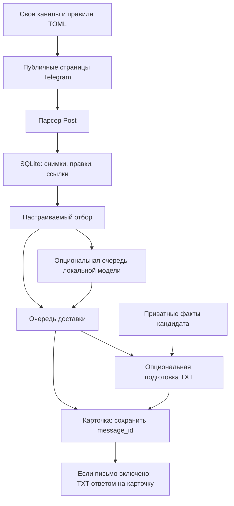

# Архитектура

## Поток данных

`Store` получает `Rules` при создании. Правила не хранятся в глобальном изменяемом состоянии; два экземпляра с разными профессиями независимы. Рабочий запуск без `matching.target_roles` запрещён. Внутренний `Store` без политики ничего не отбирает и используется, например, для очереди явного тестового сообщения.

## Таблицы

| Таблица | Содержимое |
|---|---|
| `sources` | Инициализация, максимальный ID, ошибки и следующий разрешённый запрос. |
| `posts` | Последняя версия публикации и признак `eligible`. |
| `revisions` | Наблюдавшиеся версии текста и ссылок. |
| `vacancies`, `post_keys` | Канонические URL и связи псевдонимов после правок/репостов. |
| `reviews` | Сохраняемая очередь классификации, попытки и результаты. |
| `outbox` | Карточка, исходный пост, пакет письма, этапы доставки, message_id и attachment_ids. |
| `settings` | Режим БД, глобальная задержка отправки и причина остановки доставки. |

Исходный снимок имеет `eligible=0`. Обновление фильтра или схемы не делает его рассылкой истории. При переходе с пробного режима на боевой нужна другая база. Изменение правил без изменения самого поста не запускает пересмотр всей истории автоматически.

## Состояния

Классификация: `pending → working → done`, либо возврат в `pending` с задержкой; устаревшая версия игнорируется. После эксклюзивного перезапуска незавершённое вычисление можно повторить — у него нет внешнего эффекта.

Письмо: `packet_state=pending → working → ready`. Результат принимается только для всё ещё актуального payload. Ошибка подготовки откладывает повтор. Модельный сбой обычно уже обработан внутри `prepare`: возвращается более простой готовый текст.

Доставка: `pending → inflight → sent / pending / failed / uncertain`.

- Без письма успешная карточка сразу завершает запись.
- С письмом успешная карточка сохраняет `message_id`, а запись возвращается в `pending` до загрузки TXT. Следующая попытка с ID отправляет только файл.
- 429 возвращает запись в `pending`, сохраняет ID карточки и глобальную задержку.
- Неопределённый результат не повторяется автоматически; остальные отправки останавливаются.
- `inflight`, обнаруженный после гарантированного завершения старого процесса, переводится в `uncertain`.

Транзакция захвата завершается **до HTTP-запроса**. Чтение страниц и вычисление модели не выполняются внутри долгой транзакции SQLite. Одновременно работает один фоновый исполнитель; SQLite обслуживает основной поток. На Linux один процесс владеет блокировкой файла базы.

## Границы доверия

Конфигурация и локальный профиль — настройки владельца. Публикации, ссылки, HTML и ответы модели — недоверенные данные. Они не выбирают получателя Telegram, путь credentials, сетевой адрес Ollama или произвольный локальный файл для отправки.

Ollama: фиксированный loopback, без прокси/redirect и инструментов. Исходящие страницы: только ограниченные публичные GET, каждый адрес и redirect проверяются, IP фиксируется до подключения, TLS проверяет исходное имя хоста. При недоступности сайта используется само объявление. DNS-разрешение зависит от системного резолвера и может иметь собственные таймауты.

Проверка источника цитаты — необходимая, но не достаточная проверка смысла. Отдельная модельная проверка письма тоже может ошибаться. Нельзя использовать эти механизмы как доказательство честности работодателя или полной достоверности сгенерированного вступления.

## Разделение общего кода и частной установки

Общее: парсер, планирование, состояние, настраиваемые правила, транспорт, структура профиля, опциональная модель и systemd-шаблон. Частное: источники пользователя, нужные роли, исключения, язык опыта, имя для подписи, токен, получатель, путь установки, БД и письма.

Не возвращать в общий код карьерные предпочтения одного пользователя, обязательную конкретную профессию, запреты на чужие навыки или индивидуальные шаблоны опыта. В частности, наличие облачных технологий в подтверждённом профиле инженера не должно отбрасываться из-за ограничений резюме другого человека.
